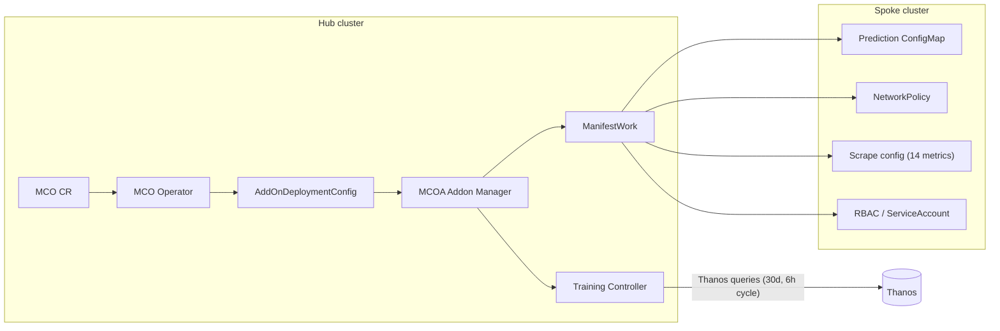

# Agentic AI SDLC: Building the Right-Sizing Prediction Engine for ACM Observability

## Executive Summary

This document describes how we delivered the **Right-Sizing Prediction Engine** for **Advanced Cluster Management (ACM) Observability** using the **Agentic AI Software Development Life Cycle (SDLC)** methodology implemented in this harness.

**What we achieved:**

- A **multi-model ensemble** prediction engine combining **Holt–Winters**, **STL (Seasonal-Trend decomposition using Loess)**, and **AR(p)** (autoregressive) approaches for resource forecasting, plus **anomaly detection** and an **optimization recommender**.
- **Deployment on OpenShift/ACM** with a **privacy-first design**: data remains on-cluster, with **NetworkPolicy**, tight **RBAC**, and **no data exfiltration** by design.
- **Engineering process**: structured phases with **human checkpoints**, **repository-grounded planning**, and **parallel AI-assisted implementation** across two correlated codebases (**MCO** and **MCOA**).

The outcome is not only operational code and cluster-validated behavior, but a repeatable pattern for **structured human–AI collaboration** on complex, multi-repo platform work.

---

## 1. What is Agentic AI SDLC?

### Structure In, Structure Out

Agentic AI SDLC treats planning and execution as **structured workflows**. Inputs are explicit (approved impact maps, task specs referencing real symbols); outputs are explicit (diffs, tests, CI green state). The AI does not free-form “implement this” from a vague brief—it **implements against an approved, code-grounded plan**.

### Constrained Phases and Human Checkpoints

The AI operates within **defined phases**, each with clear **deliverables** and **human gates** (for example: approve impact map before coding; review architectural decisions before they harden in code). This reduces **scope creep** and ensures **architectural choices happen at the right time**, not mid-implementation.

### Grounded in Real Code

Before implementation:

- The codebase is **scanned** (search, symbols, patterns).
- Plans reference **real file paths**, **real types**, and **existing patterns**—not invented APIs or hypothetical modules.

### Harness Engineering Approach

This repository embodies **harness engineering** for agentic development:

| Concept | Role |
|--------|------|
| **Repository impact map** | Enumerates affected repos/files/modules *before* code changes |
| **Structured tasks** | Break work into reviewable units tied to real paths and symbols |
| **Phase discipline** | Impact map → tasks → implementation → testing → CI fix → integration |
| **Templates & skills** | Consistent artifacts (`templates/`, `.cursor/skills/`) |

Together, these practices make agentic assistance **auditable**, **parallelizable**, and **safe** for platform teams.

---

## 2. The SDLC Phases We Followed

The following phases mirror the harness workflow and what we executed for the prediction engine.

### Phase 1: Repository Impact Map

**Activities:**

- Scanned **both** the **Multicluster Observability Operator (MCO)** and **Multicluster Observability Addon (MCOA)** codebases **before** any feature code was written.
- Identified **concrete** areas: API types, sync paths, CRDs, addon manifests, controllers, Helm charts, scrape configuration, and dashboards.

**Human checkpoint:** A reviewer **approved the impact map** before implementation began.

**Key architectural decisions (human-led, map-grounded):**

- **Prediction configuration** modeled as a **sibling field** under **`PlatformAnalyticsSpec`** (alongside existing analytics capabilities), rather than ad-hoc keys.
- **Pluggable provider architecture** so forecasting can run **built-in**, via **ONNX**, through an **external API** (with explicit consent boundaries), or a **custom endpoint**.

### Phase 2: Structured Task Creation

**Activities:**

- Translated the approved impact map into **structured tasks**.
- Each task cited **real file paths**, **symbol names**, and **patterns** already in-tree.
- Work was partitioned across:
  - **MCO**: API evolution, ADC synchronization, CRD/bundle updates, analytics scrape configs, Grafana dashboards.
  - **MCOA**: training controller, HTTP/handlers, provider implementations, Helm values, manifest generation.

**Collaboration tooling:** An **interactive canvas** was used for **task visualization** and traceability across parallel workstreams.

### Phase 3: Implementation (Parallel Execution)

**Execution model:**

- **MCO** and **MCOA** implementation proceeded **in parallel**, including use of **background subagents** where appropriate to shorten wall-clock time.

**MCO (representative scope):**

- API types (e.g., **`PlatformPredictionSpec`** and related structures).
- **ADC** synchronization for prediction feature flags and provider metadata.
- **CRD bundle** generation and consistency with the hub API.
- **Analytics scrape configuration** updates.
- **Grafana** dashboards for observability of prediction signals.

**MCOA (representative scope):**

- **Multi-model ensemble**: Holt–Winters, STL, AR(p).
- **Anomaly detection** and **optimization recommender** logic.
- **Pluggable providers**: Built-in, ONNX, External API, Custom Endpoint.
- **Training controller** orchestration (training cadence, data access, persistence).
- **Helm chart values** and **scrape config generation** for spokes.

**Multi-dimension support:**

| Dimension | Signals (representative) |
|-----------|---------------------------|
| **Namespace** | CPU, Memory |
| **Workload / Pod** | CPU, Memory |
| **GPU** | Utilization, Memory |
| **Virtualization / VM** | CPU, Memory |

### Phase 4: Testing

**Activities:**

- **Unit tests** for ensemble components, training controller behavior, and providers.
- **Lint remediation** at scale: **96 golangci-lint issues** resolved in MCOA (see Phase 6 for rule categories).
- **CRD bundle validation** to prevent structural drift between API and shipped CRDs.

### Phase 5: PR Creation

**Activities:**

- **Separate pull requests** for **MCO** and **MCOA** on a personal fork (fork-only development; **no upstream pushes** in this phase).
- Shared feature branch convention: **`feature/rs-prediction-engine`**.

This separation keeps reviews **focused**, rollback **surgical**, and CI **actionable per repo**.

### Phase 6: CI & Auto-fix

**MCO CI fixes (examples):**

- **Dashcheck metrics validation**: added **`--ignored-scrapeconfig-metrics`** allowances for **prediction metrics** where required by policy tooling.
- **CRD bundle drift**: regenerated via **`make bundle`** and aligned manifests.
- **Missing scrape config entries**: restored coverage for **~45** workload/pod/GPU-related metrics needed for downstream analytics.

**MCOA CI fixes (examples):**

- **96 golangci-lint issues** across modernizers and classic linters, including: **modernize**, **staticcheck**, **err113**, **errcheck**, **govet**, **gci**, **copyloopvar**, **misspell**, and related hygiene.
- **Handler signature mismatches** and **constant alignment** brought back in sync with refactors.

### Phase 7: Integration Testing (Cluster Deployment)

Integration was the **most complex** phase, with several **diagnose–fix** iterations on a live ACM topology.

#### Image build and push

| Component | Example image |
|-----------|----------------|
| **MCO** | `<registry>/<org>/multicluster-observability-operator:<tag>` |
| **MCOA** | `<registry>/<org>/multicluster-observability-addon:<tag>` |

**Example build flow:**

```bash
# MCO
make docker-build docker-push IMG=<registry>/<org>/multicluster-observability-operator:<tag>

# MCOA
make oci-build IMG=<registry>/<org>/multicluster-observability-addon:<tag>
```

#### Deployment challenges solved

1. **`mch-image-manifest` reverted by MCH** → Applied **MCO CR annotation overrides** (e.g., `mco-endpoint_monitoring_operator-image`) to pin the desired operator image through reconciliation storms.
2. **Spoke addon printed help and exited** → Added **`os.Args` / binary name detection** for `endpoint-monitoring-operator` so the process enters the correct code path.
3. **Read-only filesystem crash** → Added an **`emptyDir` volume** mount for `/tmp` in the **`operator.yaml`** template (runtime writes must land on writable storage).
4. **MCH operator reverted MCO image** → **Scaled down** `multiclusterhub-operator` tactically, then moved to a **sustainable image-override workflow** aligned to ACM norms.
5. **ADC missing prediction keys** → Fixed MCO to write **`"enabled"`** (not **`"true"`**) and to include prediction in **`rightSizingEnabled()`** (and related decision logic) so downstream components see a consistent contract.
6. **Training controller not wired** → Introduced **`hub_run.go`** (or equivalent hub entry wiring) to **start the training controller** from the addon manager context.
7. **MCOA architecture misunderstanding** → Corrected mental model: **MCOA runs on the hub** as part of **addon manager** responsibilities—not as a “spoke-only” workload for this control plane.

#### `acm-tools` workflow (operational summary)

```bash
# Switch tooling mode to MCOA-facing workflows
bin/rs-mode-switch mcoa

# Apply image overrides and force reconciliation paths as needed
bin/image-override apply --force-reconcile

# Patch mch-image-manifest for MCOA image resolution when required
# (exact patch content varies by cluster state and manifest generation)
```

#### Final verified state (high level)



- **End-to-end path validated:** `MCO CR → ADC → MCOA addon manager → ManifestWork → spoke`.
- **Training controller** running on configured cadence (**6h** cycle, **30d** history, **Thanos**-backed queries).
- **Privacy enforced:** **NetworkPolicy**, **RBAC**, **no data exfiltration** off-cluster for prediction state.
- **Spoke scrape config** includes **14** `acm_rs:prediction_*` series for operational visibility.

---

## 3. The Agentic AI Advantage

### Parallel Execution

- **MCO** and **MCOA** were implemented **concurrently**, including parallel subagent-style execution for long-running tasks.
- **CI fixes** could proceed **in parallel** across repositories without blocking unrelated workstreams.
- **Image builds** were parallelized where infrastructure allowed.

### Real-Time Debugging

- Complex **cluster integration** failures were triaged **iteratively** with evidence from live operators (logs, CR status, ManifestWork payloads).
- Agents **read MCO source** to understand **`ReplaceImage`**, **`imageManifests`** maps, and reconciliation ordering.
- Agents **deep-dived `acm-tools`** to align with supported deployment flows instead of one-off cluster hacks.
- Cross-referencing **ManifestWork**, **ADC**, **`mch-image-manifest`**, and **MCO CR** turned “mystery reconciles” into **explainable state machines**.

### Human–AI Collaboration

- **Humans** provided **architecture** (sibling prediction field, provider taxonomy) and **environment context** (image registries, cluster constraints, build commands).
- **AI** executed **multi-step debugging** with **checkpoints** at high-risk pivots (image pinning, ADC contract, controller wiring).
- **Humans** **approved** the **impact map** before code locked in assumptions—cheap early, expensive late.

### Code Quality

- Large-scale **lint cleanup** (e.g., **96** issues) with consistent fixes rather than blanket suppressions.
- **CRD bundles** regenerated and validated.
- **Tests** authored alongside features—not deferred.
- **Commit conventions** followed: `feat|fix|test|docs(<scope>): <description>`.

---

## 4. Architecture Overview

### Prediction engine components

**ASCII overview (control + data plane):**

```
MCO CR (Hub)
  └── spec.capabilities.platform.analytics.prediction
       ├── enabled: true
       └── provider.type: builtin | onnx | external | custom

MCO Operator (Hub)
  └── Syncs prediction config → AddOnDeploymentConfig (ADC)
       ├── platformRightSizingPrediction = "enabled"
       ├── platformRightSizingPredictionProvider = "builtin"
       └── platformRightSizingPredictionConfig = "{}"

MCOA Addon Manager (Hub)
  ├── Reads ADC → enables prediction in BuildOptions
  ├── Renders ManifestWork per spoke cluster
  │    ├── rs-prediction-config (ConfigMap)
  │    ├── rs-prediction-policy (NetworkPolicy)
  │    ├── rs-prediction-sa (ServiceAccount)
  │    ├── rs-prediction-role (ClusterRole)
  │    └── rs-prediction-binding (ClusterRoleBinding)
  └── Training Controller (goroutine)
       ├── Queries Thanos (30d history, 6h cycle)
       ├── Multi-model ensemble: Holt-Winters + STL + AR(p)
       ├── Anomaly detection
       └── Persists model state → ConfigMap

Spoke (via ManifestWork + klusterlet)
  ├── Prediction ConfigMap deployed
  ├── NetworkPolicy enforced (no data leaves cluster)
  ├── Metrics scrape config (14 acm_rs:prediction_* series)
  └── RBAC + ServiceAccount for prediction workload
```

### Multi-dimension prediction

| Level | Targets |
|-------|---------|
| **Namespace** | CPU, memory |
| **Workload / Pod** | CPU, memory |
| **GPU** | Utilization, memory |
| **Virtualization / VM** | CPU, memory |

### Pluggable provider architecture

1. **Built-in (default):** Go-native ensemble; **no external model server** required.
2. **ONNX:** Load and run **exported models** via an ONNX runtime path.
3. **External API:** Delegate inference to an **external prediction service** with explicit operational and privacy consent boundaries.
4. **Custom endpoint:** User-specified inference endpoint for specialized deployments.

---

## 5. Metrics & Outcomes

| Metric | Value |
|--------|-------|
| Total phases completed | 8 (Impact Map → … → CI fix → Integration test) |
| Repos modified | 2 (**MCO** + **MCOA**) |
| Files changed (approx.) | **~50+** across both repos |
| CI issues fixed | **96** lint items + **3** MCO CI failures (representative) |
| Deployment blockers resolved | **7** distinct integration issues |
| Image versions built | **MCO v0302**, **MCOA v304** |
| Prediction dimensions | **4** (Namespace, Workload/Pod, GPU, VM) |
| Provider types | **4** (Built-in, ONNX, External, Custom) |
| Data privacy posture | **100% on-cluster** enforcement via **NetworkPolicy** + RBAC |

---

## 6. Lessons Learned

- **Ground plans in real code first.** The best agentic workflows fail softly when the map is speculative—this project succeeded because discovery preceded implementation.
- **ACM image plumbing is a system, not a knob.** Effective debugging required following **MCH → MCO → MCOA → ManifestWork** holistically.
- **MCOA runs on the hub** in the addon manager model for this workstream—**topology assumptions** must be validated early; they change controller wiring, volumes, and credentials.
- **Phase discipline prevents scope creep.** Human checkpoints kept “small fixes” from becoming undeclared architecture.
- **Parallel subagents reduce calendar time** when tasks are **independently mergeable** and **well-specified**.
- **Early human decisions** (sibling field placement, provider taxonomy) **prevented expensive rework** after APIs and CRDs stabilized.

---

## 7. What's Next

- **Monitor** the training controller for **first durable model state** in the expected `ConfigMap` artifacts.
- **Validate Perses dashboards** (and Grafana where applicable) using **live prediction series** once training has produced stable outputs.
- **Open upstream PRs** when fork validation is complete and organizational readiness allows.
- **Add E2E tests** covering the full **MCO → ADC → MCOA → ManifestWork → spoke scrape** prediction pipeline to protect against regressions in reconciliation contracts.

---

## Appendix: Methodology alignment

This effort aligns with the harness principles documented in `CLAUDE.md` and `.cursorrules` in this repository:

- **Structure in, structure out** (maps, tasks, explicit phases)
- **Human checkpoints** between planning and implementation
- **Tests alongside implementation** and **CI remediation** as a first-class phase
- **One cohesive story across two repos**, still **separated by PR** for reviewability

---

*Document version: initial org-facing narrative — May 2026.*
